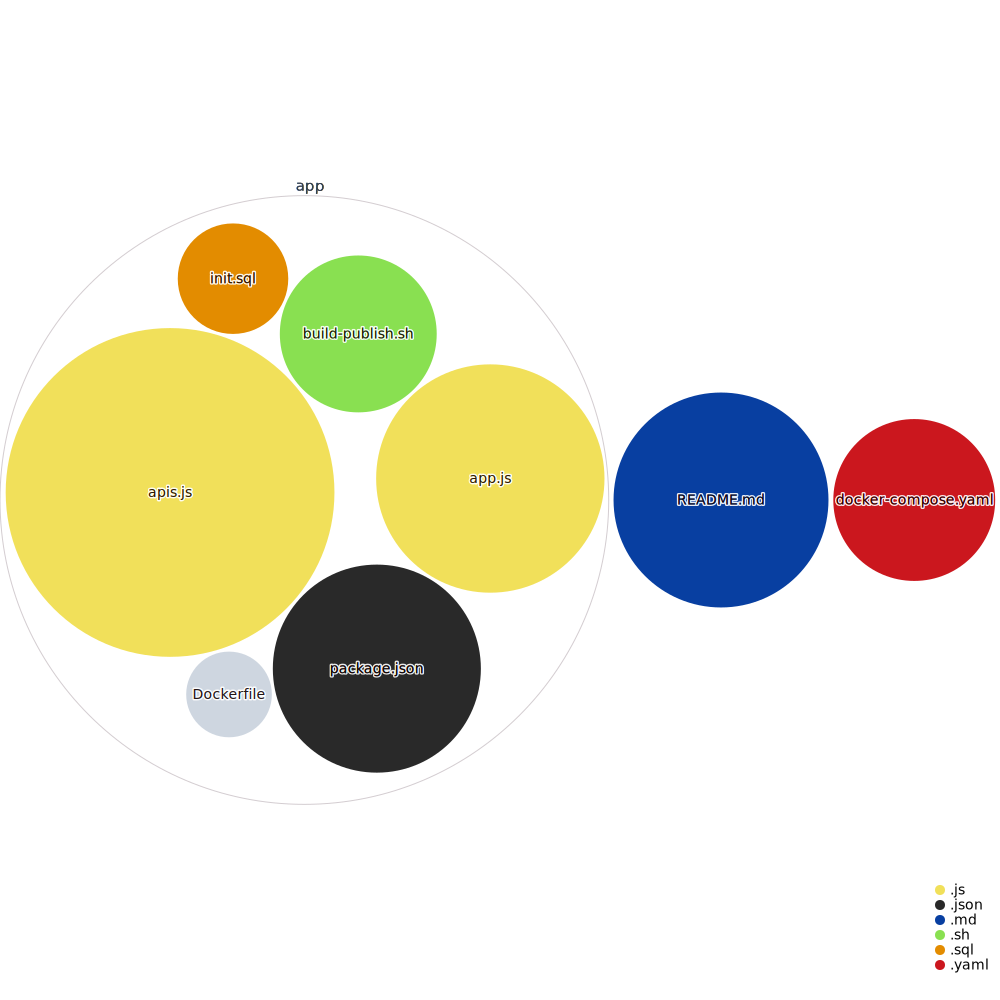

# crud-app
Basic Express app w/ a DB and set of APIs to do CRUD operations with.

h/t to this [tutorial](https://blog.logrocket.com/nodejs-expressjs-postgresql-crud-rest-api-example/)

### Quickstart

`docker compose up -d`

`http :3000/users`

`http post :3000/users name=Mary email=mary@example.com`

### Building the Express app

`cd app`

`docker buildx create --use`

`docker buildx build --platform linux/amd64,linux/arm64 -t <your_docker_hub_account>/crud-app --push .`

### Visualizing the codebase

