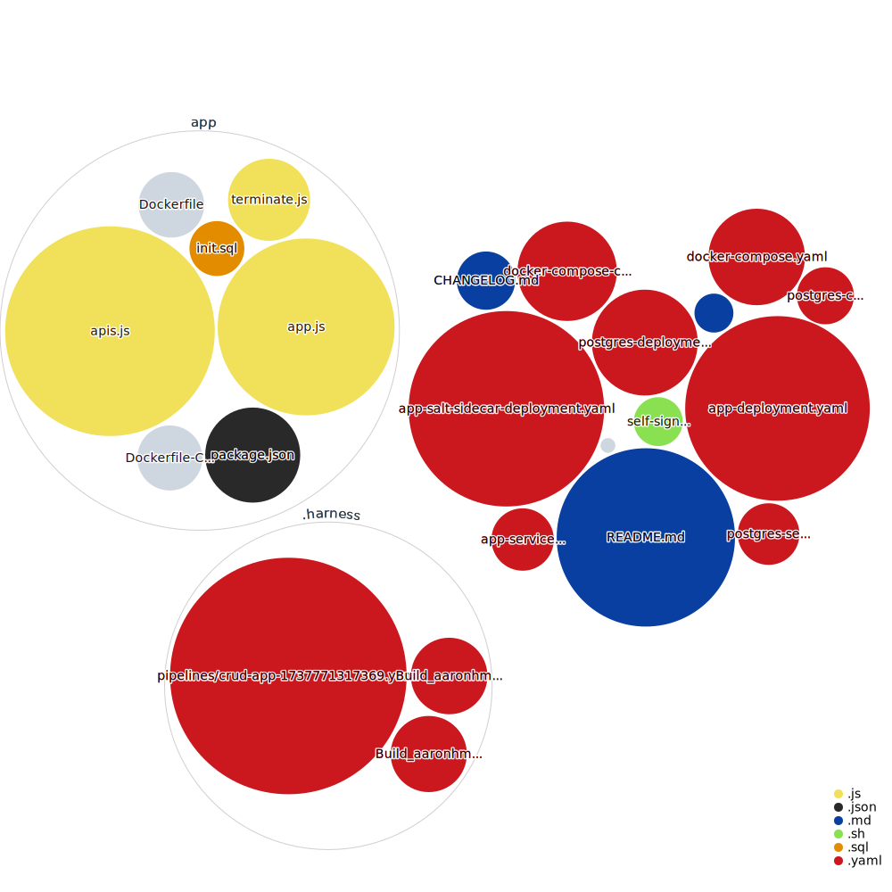

[](https://github.com/aaronhmiller/crud-app/actions/workflows/ci-test.yaml) [](https://standardjs.com)
[](https://github.com/aaronhmiller/crud-app/actions/workflows/branch-build-push.yaml)

# crud-app
Basic Express app w/ a DB and set of APIs to do CRUD operations with.

h/t to this [tutorial](https://blog.logrocket.com/nodejs-expressjs-postgresql-crud-rest-api-example/)

### Quickstart

`docker compose up -d`

`http :/users`

`http post :/users name=Mary email=mary@example.com`

### Using TLS

To illustrate usage of certificates and keys (note that currently the included cert is for a domain I run in Cloudflare hence the no verify flag), run:

`https :/users --verify no`

### Passing in your own TLS
To provide your own cert and key, set them as environment variables in your shell, run it using docker compose, and it'll pass the KEY and CERT as env vars to the Node process.

### Building the Express app

`cd app`

`./self-signed.sh` to generate the cert and key referenced in the app.js file

`docker buildx create --use`

```
docker buildx build --platform linux/amd64,linux/arm64 \
 -t <your_docker_hub_account>/crud-app --push .
```

### Using standard to enforce style guidelines

`npm i pg express standard`

`npm test` to see guidance from standard package

`npx standard --fix` to apply the rules from standard in an automated way 

Alternatively, you can run `npm run fix` which has been added to the package.json

### Visualizing the codebase


